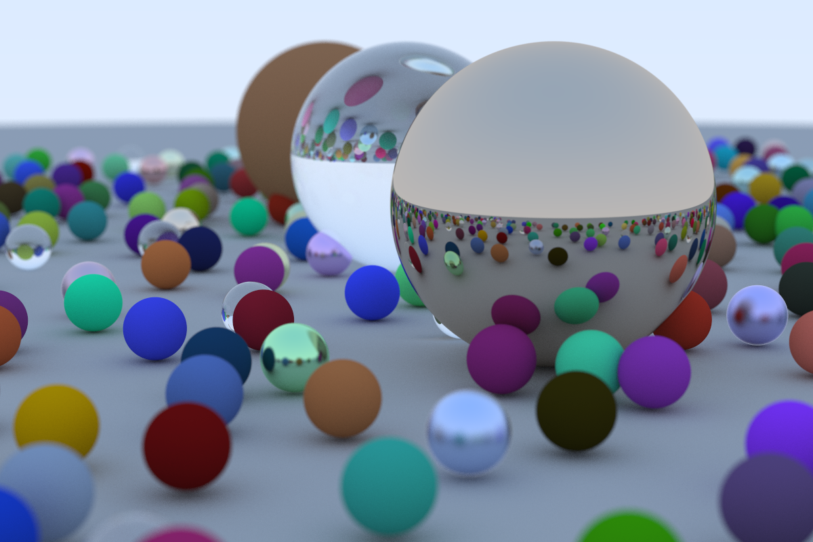

Tutorial repo for ["Ray Tracing in One Weekend"](https://raytracing.github.io/books/RayTracingInOneWeekend.html).

I first got into this since I was interested in running "something" on my GPU. I then found ["Accelerated Ray Tracing in One Weekend in CUDA"](https://developer.nvidia.com/blog/accelerated-ray-tracing-cuda/), but since raytracing was new to me, I started with this version first.

This 1200x800 image took 5h 19m 52s to generate on my system (cf. the 100s that the [CUDA version](//boatrite/accelerated-ray-tracing-in-one-weekend-in-cuda) took)

